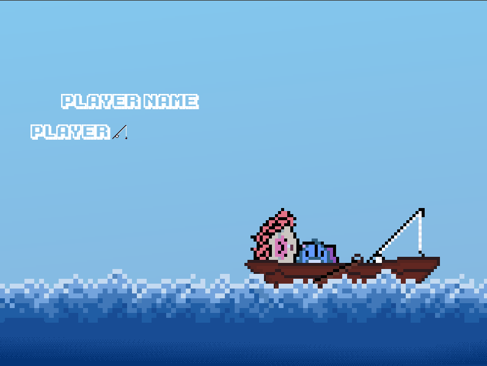
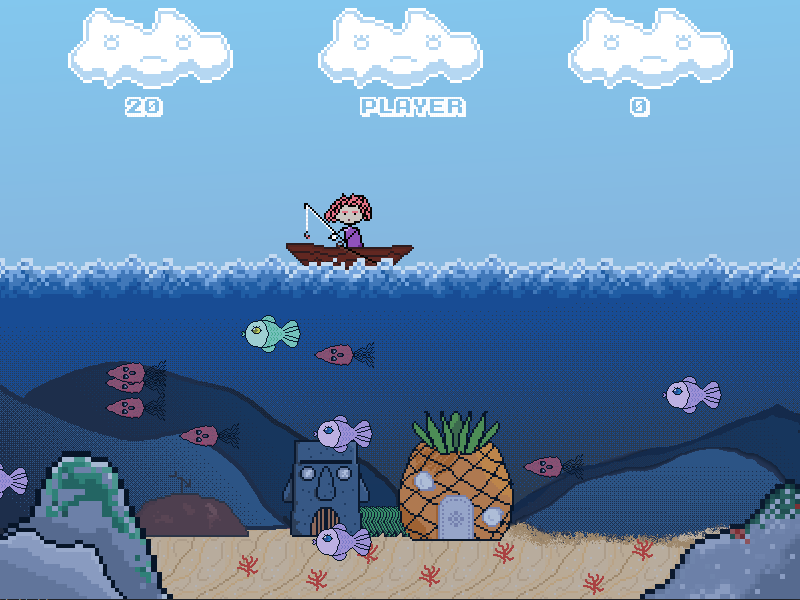
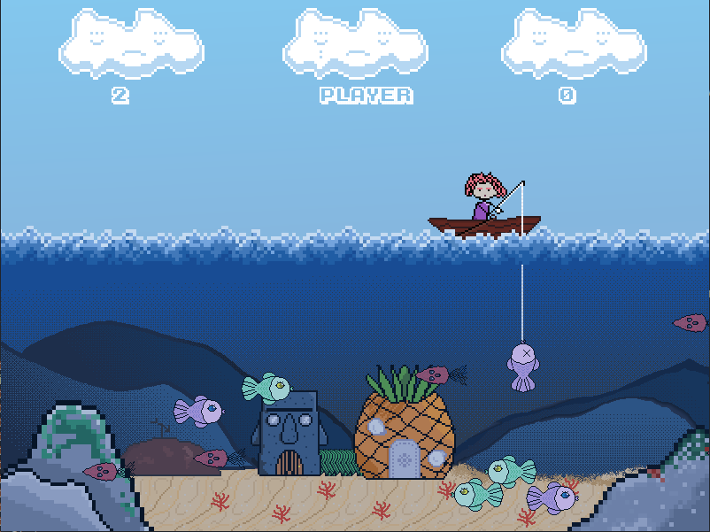
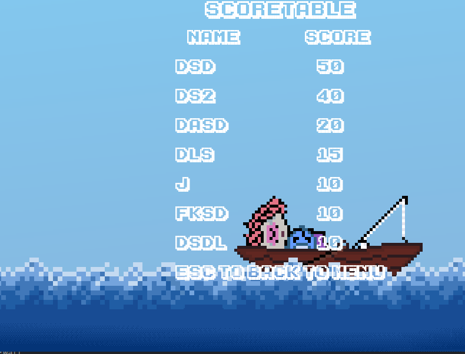

# FishingForFishies
Yolo-coded game with Component object model.

## Gameplay
Small and quite simple arcade. The main point of game is to catch fishies as much as possible.
## Control
Here is player control help-note
```
A,D - to move boat;
SPACE - to throw hook;
UP,DOWN - to move hook;
```
## Footage
- Input player name


- Start game


- First catch


- Score table


## Third-party libraries
* <a href="https://www.libsdl.org/download-2.0.php">SDL2</a>
* <a href="https://www.libsdl.org/projects/SDL_image">SDL2 image</a>
* <a href="https://www.libsdl.org/projects/SDL_ttf/">SDL2 ttf</a>
* <a href="https://www.libsdl.org/projects/SDL_mixer/">SDL2 mixer</a>
## Assets 
<a href="https://alohaeee.itch.io/fishing-assets">itch.io page</a>
